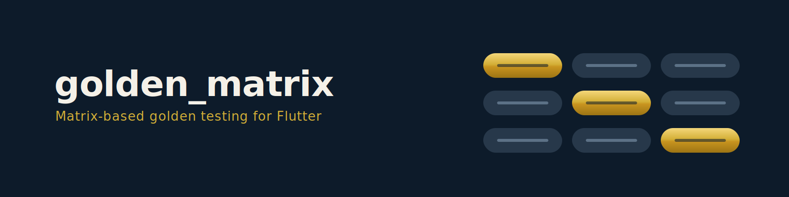

# golden_matrix

{ width="100%" }

[](https://pub.dev/packages/golden_matrix)
[](https://github.com/mavoryl/golden_matrix/actions/workflows/test.yml)
[](https://codecov.io/gh/mavoryl/golden_matrix)

Matrix-based visual regression testing for Flutter widgets and screens. Write
one golden test declaration, run it across themes, locales, devices, text
scales, and UI states.

## The problem

Flutter golden tests check **one specific case**. When you add themes, locales,
device sizes, and states, you get copy-paste and combinatorial explosion:

```dart
// Without golden_matrix: manual loops, boilerplate wrappers
for (final locale in supportedLocales) {
  for (final device in devices) {
    testGoldens('screen_${locale.languageCode}_${device.name}', (tester) async {
      // 30+ lines of wrapper setup per combination...
    });
  }
}
```

## The solution

```dart
// With golden_matrix: one declaration, full coverage
matrixGolden(
  'PrimaryButton',
  scenarios: [
    MatrixScenario('default', builder: () => const PrimaryButton(label: 'OK')),
    MatrixScenario('disabled', builder: () => const PrimaryButton(label: 'OK', enabled: false)),
  ],
  axes: MatrixAxes(
    themes: [MatrixTheme.light, MatrixTheme.dark],
    locales: [Locale('en'), Locale('ar')],
    textScales: [1.0, 2.0],
    devices: [MatrixDevice.phoneSmall, MatrixDevice.phoneLarge],
  ),
);
// 2 scenarios × 2 themes × 2 locales × 2 scales × 2 devices = 32 golden files
```

## Quick start

### 1. Add the dependency

```yaml
# pubspec.yaml
dev_dependencies:
  golden_matrix: ^1.1.0
```

### 2. Set up font loading

```dart
// test/flutter_test_config.dart
import 'dart:async';
import 'package:golden_matrix/golden_matrix.dart';

Future<void> testExecutable(FutureOr<void> Function() testMain) async {
  await loadAppFonts();
  return testMain();
}
```

!!! tip "Layout-deterministic tests"
    `loadAppFonts(textFonts: false)` loads only icon fonts and uses Ahem
    placeholders for text, so text geometry is predictable across macOS/Linux
    CI while icons still render with real glyphs. See [Advanced](advanced.md).

### 3. Write your first matrix test

```dart
import 'package:flutter/widgets.dart';
import 'package:golden_matrix/golden_matrix.dart';

void main() {
  matrixGolden(
    'MyButton',
    scenarios: [
      MatrixScenario('default', builder: () => const MyButton(label: 'OK')),
      MatrixScenario('disabled', builder: () => const MyButton(label: 'OK', enabled: false)),
    ],
    axes: MatrixAxes(
      themes: [MatrixTheme.light, MatrixTheme.dark],
      devices: [MatrixDevice.phoneSmall, MatrixDevice.tablet],
    ),
  );
}
```

### 4. Generate baselines and run

```bash
flutter test --update-goldens  # generate baselines
flutter test                   # run regression tests
```

## The three entry points

`golden_matrix` exposes three test functions — pick by the surface you're
capturing:

### matrixGolden — component testing

Auto-wraps your widget in a `MaterialApp` with theme, locale, directionality,
text scale, and device configuration. Reach for it when the component needs a
`Scaffold` context (AppBar/FAB positioning, full device viewport).

```dart
matrixGolden(
  'ProfileCard',
  scenarios: [
    MatrixScenario('loading', builder: () => const ProfileCard.loading()),
    MatrixScenario('data', builder: () => ProfileCard(user: fakeUser)),
    MatrixScenario('error', builder: () => const ProfileCard.error('Timeout')),
  ],
  axes: MatrixAxes(
    themes: [MatrixTheme.light, MatrixTheme.dark],
    locales: [Locale('en'), Locale('ru'), Locale('ar')],
    devices: [MatrixDevice.iphoneSE, MatrixDevice.tablet],
  ),
);
```

### screenMatrixGolden — screen testing

You provide the full `MaterialApp` via `appBuilder` — for DI, navigation,
custom themes, full-screen flows.

```dart
screenMatrixGolden(
  'LoginScreen',
  appBuilder: (combination) => MaterialApp(
    theme: combination.theme.resolve(),
    locale: combination.locale,
    home: LoginScreen(
      errorMessage: combination.scenario.name == 'error' ? 'Invalid credentials' : null,
    ),
  ),
  states: [
    MatrixScenario('default', builder: () => const SizedBox.shrink()),
    MatrixScenario('error', builder: () => const SizedBox.shrink()),
  ],
  preset: MatrixPreset.screenSmoke,
);
```

### componentMatrixGolden — intrinsic-size testing

For small visual primitives — buttons, badges, chips, list tiles — captured at
their **natural** size instead of a full device viewport. Keeps the full
`MaterialApp` context (theme, fonts, icons, locale, overlays); the PNG is
exactly widget-sized plus optional padding. The `devices` axis is ignored.

```dart
componentMatrixGolden(
  'ShadButton',
  scenarios: [
    MatrixScenario('primary', builder: () => const ShadButton(child: Text('Click'))),
    MatrixScenario('destructive', builder: () => const ShadButton.destructive(child: Text('Delete'))),
  ],
  axes: const MatrixAxes(themes: [MatrixTheme.light, MatrixTheme.dark]),
);
```

## What's in the box

- **Declarative matrix** — define axes (themes, locales, devices, text scales,
  directions), get all combinations automatically.
- **Smart defaults** — `MatrixAxes()` with no arguments produces one valid test
  (light, en, 1.0x, phoneSmall).
- **RTL auto-inference** — Arabic, Hebrew, Farsi automatically get RTL.
- **[Typed scenarios](advanced.md)** — `MatrixScenario.typed<T>` attaches a
  compile-time-checked state payload so one builder covers all states.
- **[Sampling](sampling.md)** — `full`, `smoke`, `pairwise`, `priorityBased`
  to keep CI fast.
- **[20+ device presets](devices.md)** — modern iPhones, Android, foldables,
  the full iPad lineup, plus `copyWith()` and fully custom devices.
- **[Reports](reports.md)** — self-contained HTML with diff thumbnails, JSON,
  Markdown summary, and opt-in JUnit XML.
- **Stale golden detection** — flags orphan PNGs after renamed scenarios or
  dropped axes, no extra code.
- **Overflow detection** — `RenderFlex overflow` and layout errors surface as
  report warnings.
- **[DI-friendly](advanced.md)** — `wrapApp` / `wrapChild` hooks for
  `ProviderScope`, `BlocProvider`, `MultiProvider`.
- **Dry-run preview** — `previewMatrixGolden(...)` reports counts, paths, and
  collisions without rendering.
- **Zero external dependencies** — only the Flutter SDK.

## Explore the docs

- **[Sampling](sampling.md)** — strategies and presets to cut combination count
- **[Devices](devices.md)** — preset table, custom devices, `copyWith`
- **[Reports](reports.md)** — HTML/JSON/Markdown/JUnit, stale & overflow detection
- **[CI integration](ci.md)** — GitHub Actions, JUnit dashboards, monorepos
- **[Advanced](advanced.md)** — rules, tolerance, DI hooks, post-pump state, theming
- **[Migration guide](migration.md)** — from `golden_toolkit`, `alchemist`, hand-rolled goldens

## Requirements

- Flutter SDK >= 3.16.0
- Dart SDK >= 3.2.0

## License

MIT
